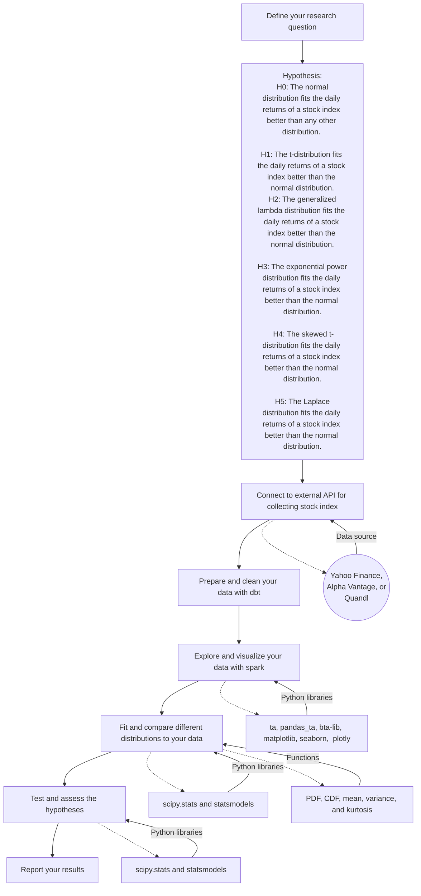

# How different distributions fit the daily returns of a stock index?

**Overview**: This is a research project that explores and compares the suitability and performance of different probability distributions for modeling the daily returns of a stock index. It uses the S&P 500 index as an example, and tests various distributions, such as the normal, t, generalized lambda, exponential power, skewed t, and Laplace distributions.

## **Background** 
- A stock index is a measure of the performance of a group of stocks that represent a market or a sector. 
- The daily return of a stock index is the percentage change in its value from one trading day to the next. 
- The daily returns of a stock index are often assumed to follow a *normal distribution*, which has a bell-shaped curve and is symmetric around its mean. However, the normal distribution may not capture the characteristics of the daily returns of a stock index, such as the skewness, kurtosis, and volatility. 
    - Skewness is a measure of how asymmetric a distribution is around its mean. 
    - Kurtosis is a measure of how peaked or flat a distribution is compared to the normal distribution. 
    - Volatility is a measure of how much the daily returns of a stock index vary over time. 
- Therefore, some alternative distributions have been proposed to better fit the daily returns of a stock index, such as the *t-distribution*, the *generalized lambda distribution*, the *exponential power distribution*, the *skewed t-distribution*, and the *Laplace distribution*. These distributions have different shapes, parameters, and properties that can account for the skewness, kurtosis, and volatility of the daily returns of a stock index.

## **Hypothesis**
$$
\begin{align*}
H_0: \mathcal{N} &> \text{any other distribution}\\
H_1: \mathcal{T} &> \mathcal{N}\\
H_2: \mathcal{GL} &> \mathcal{N}\\
H_3: \mathcal{EP} &> \mathcal{N}\\
H_4: \mathcal{ST} &> \mathcal{N}\\
H_5: \mathcal{L} &> \mathcal{N}
\end{align*}
$$

$$
\text{where } \mathcal{N} \text{ is the normal distribution, } \mathcal{T}  \text{ is the t-distribution, } \mathcal{GL} \text{ is the generalized lambda distribution,} \\
\mathcal{EP} \text{ is the exponential power distribution, } \mathcal{ST} \text{ is the skewed t-distribution, and } \mathcal{L} \text{ is the Laplace distribution.}
$$

These hypotheses will be tested using statistical methods and criteria, such as the maximum likelihood estimation (MLE) and the Akaike information criterion (AIC).

## Plan of the project

